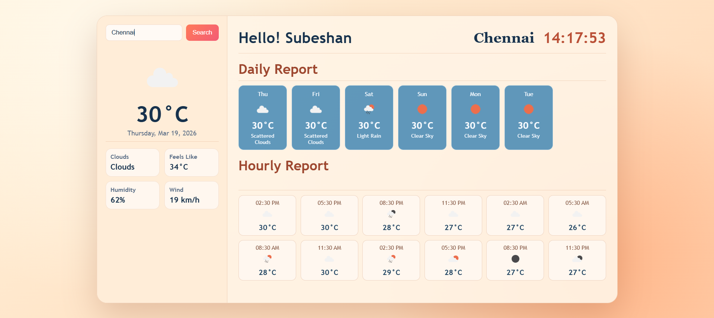

# Weather Dashboard

A modern weather dashboard built with React and Vite that shows:

- Current weather
- Hourly forecast
- 7-day outlook
- Live clock and location-based city weather

The app uses the OpenWeather API and provides a clean, responsive UI for both desktop and mobile.

## Preview

Screenshots:



Deployed demo link:

- Live Demo: `https://mern-weather-app-brown.vercel.app/`

## Features

- Search weather by city name
- Displays current temperature, weather condition, humidity, wind speed, cloud status, and feels-like temperature
- Daily report (7-day style summary from forecast data)
- Hourly report (upcoming forecast slots)
- Real-time digital clock
- Fully responsive layout
- Weather icons from OpenWeather

## Tech Stack

- React 19
- Vite 7
- JavaScript (ES Modules)
- CSS3 (custom responsive styling)
- OpenWeather API

## Project Structure

```
weather/
├─ public/
├─ src/
│  ├─ assets/
│  ├─ App.css
│  ├─ App.jsx
│  ├─ index.css
│  └─ main.jsx
├─ index.html
├─ package.json
└─ vite.config.js
```

## Getting Started

### 1. Clone the repository

```bash
git clone https://github.com/<your-username>/weather.git
cd weather
```

### 2. Install dependencies

```bash
npm install
```

### 3. Configure API key

This project currently uses OpenWeather API for weather data.

Create a `.env` file in the root directory:

```env
VITE_OPENWEATHER_API_KEY=your_api_key_here
```

Get your API key from: https://openweathermap.org/api

> Recommended: move API usage to `import.meta.env.VITE_OPENWEATHER_API_KEY` in your app code for easier key management between environments.

### 4. Run the development server

```bash
npm run dev
```

Then open the local URL shown in your terminal (usually `http://localhost:5173`).

## Available Scripts

- `npm run dev` - Start development server
- `npm run build` - Create production build
- `npm run preview` - Preview production build locally
- `npm run lint` - Run ESLint checks

## API Endpoints Used

- Current weather by city name:
	- `https://api.openweathermap.org/data/2.5/weather`
- 5-day / 3-hour forecast by coordinates:
	- `https://api.openweathermap.org/data/2.5/forecast`

## Deployment

You can deploy this app easily on:

- Vercel
- Netlify
- GitHub Pages (with a Vite-compatible workflow)

Build command:

```bash
npm run build
```

Output directory:

- `dist`

## Improvements Roadmap

- Add unit toggle (Celsius/Fahrenheit)
- Add geolocation-based auto-detect city
- Add weather maps and sunrise/sunset details
- Add loading skeletons and better error states
- Cache recent searches
- Move API key fully to environment variables

## Contributing

Contributions are welcome.

1. Fork the repository
2. Create a feature branch
3. Commit your changes
4. Open a Pull Request

## License

This project is open source under the MIT License.

---

If you like this project, consider giving it a star.
#
